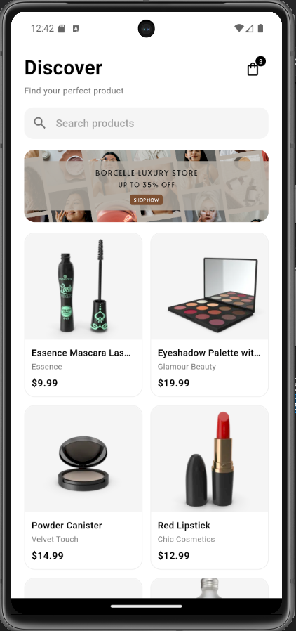
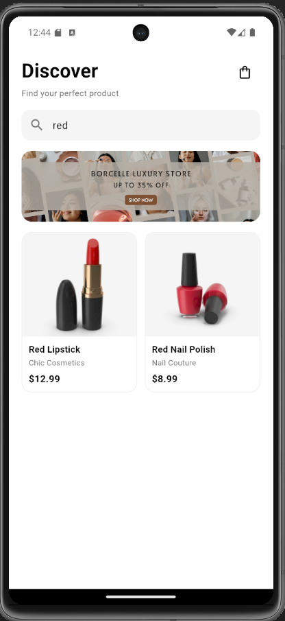
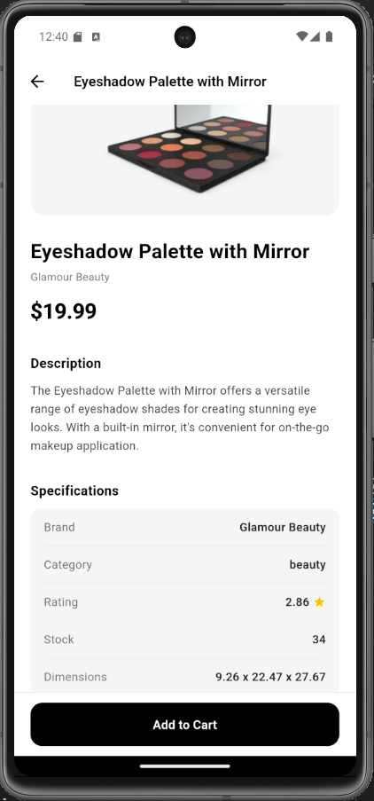
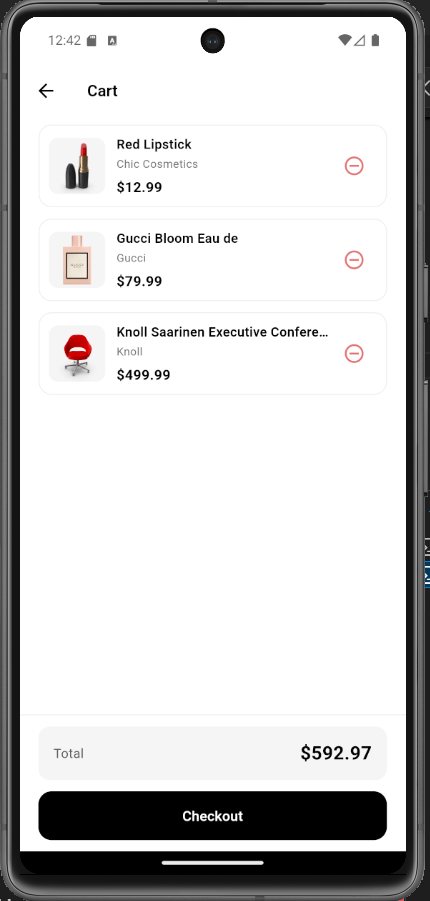
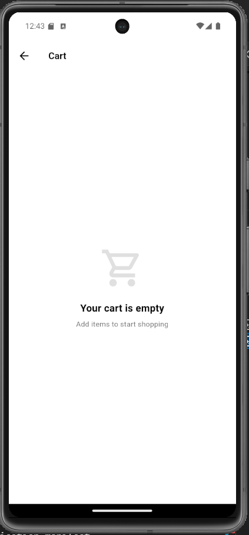

# Mini Catalog App

A mini catalog application built with Flutter that fetches products from the DummyJSON REST API. Users can browse products in a grid, search them by name, and open a detail page for each item. Products can be added to and removed from an in-memory cart.

## Features

- Product listing in a two-column grid
- Search and filter products by name
- Product detail screen with description and specifications
- Add to / remove from cart, with a live badge on the cart icon
- Empty cart and error states, with retry on failed requests

## Tech Stack

- Flutter 3.19.6 / Dart 3.3.4
- `http` package for REST API calls
- State management: `setState` only (no external state package)
- Data source: [DummyJSON API](https://dummyjson.com/products)

## Screenshots

### Discover and Search

The home screen lists all products in a grid. Typing in the search field filters the list by product name.

 

### Product Detail

Each product opens a detail screen with its image, price, description and specifications.



### Cart

The cart lists the selected products with a total, or shows an empty state when nothing has been added.

 

## Getting Started

Requires the Flutter SDK 3.19.6 (or a compatible version). The app needs an internet connection, since all product data is fetched from the API at runtime.

1. Clone the repository:
   ```bash
   git clone <repository-url>
   cd mini_katalog
   ```
2. Install dependencies:
   ```bash
   flutter pub get
   ```
3. Run the app on a connected device or emulator:
   ```bash
   flutter run
   ```

## Project Structure

```
lib/
  main.dart
  models/
  services/
  views/
  components/
```

- `main.dart` — app entry point, theme and `MaterialApp` setup
- `models/` — product data model (`Data`) and API response wrapper
- `services/` — `ApiService`, fetches products from DummyJSON
- `views/` — home (discover), product detail and cart screens
- `components/` — reusable UI widgets (product card, cart tile, empty/info boxes)
